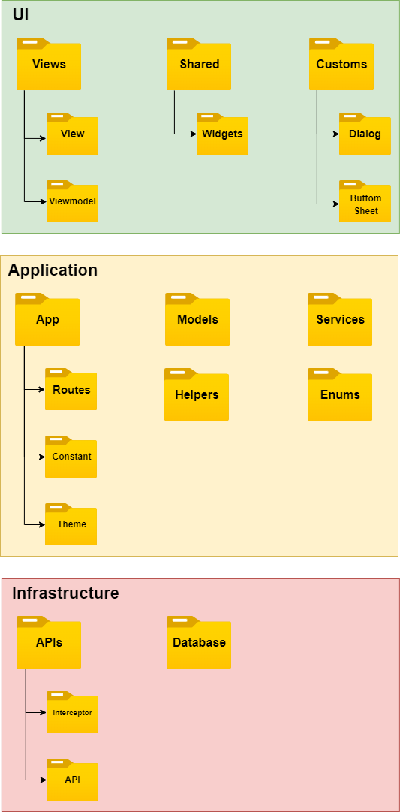

# COVID-19 Expert System

COVID-19 Expert System Mobile Apps

<br/>

> An expert system was created with the Forward Chaining method that can provide recommendations for solutions to the symptoms of COVID-19 and also diagnose virus variants. The collection data of symptom and solution used is in the form of a questionnaire from interviews with medical personnel at the Puskesmas Kelurahan Pulo Gebang. This expert system can be used as a decision maker to help medical personnel take better actions and administration before a swab test is carried out to diagnose early what variant virus the patient has been exposed to. 

## Architecture

We are using [Stacked Architecture](https://www.filledstacks.com/post/flutter-and-provider-architecture-using-stacked) which was an implementation of MVVM.



## Flutter Channel

Flutter has four [release channels](https://github.com/flutter/flutter/wiki/Flutter-build-release-channels): stable, beta, dev, and master. We decide using the stable channel for production app releases.

## Flutter Documentation

For help with Flutter, view [online documentation](https://flutter.dev/docs), which offers tutorials, samples, guidance on mobile development, and a full API reference.

## VS Code Extensions

### Necessary

- [Flutter](https://marketplace.visualstudio.com/items?itemName=Dart-Code.flutter)
- [Dart](https://marketplace.visualstudio.com/items?itemName=Dart-Code.dart-code)

### Optional

- [Prettier](https://marketplace.visualstudio.com/items?itemName=esbenp.prettier-vscode)
- [Material Icon Theme](https://marketplace.visualstudio.com/items?itemName=PKief.material-icon-theme)
- [Git Graph](https://marketplace.visualstudio.com/items?itemName=mhutchie.git-graph)
- [Todo Tree](https://marketplace.visualstudio.com/items?itemName=Gruntfuggly.todo-tree)
- [Dart Import](https://marketplace.visualstudio.com/items?itemName=luanpotter.dart-import)
- [Dart Data Class Generator](https://marketplace.visualstudio.com/items?itemName=BendixMa.dart-data-class-generator)
- [Pubspec Assist](https://marketplace.visualstudio.com/items?itemName=jeroen-meijer.pubspec-assist)
- [Version Lens](https://marketplace.visualstudio.com/items?itemName=pflannery.vscode-versionlens)
- [Bracket Pair Colorizer](https://marketplace.visualstudio.com/items?itemName=CoenraadS.bracket-pair-colorizer)
- [Better Comments](https://marketplace.visualstudio.com/items?itemName=aaron-bond.better-comments)
- [Awesome Flutter Snippets](https://marketplace.visualstudio.com/items?itemName=Nash.awesome-flutter-snippets)

## Running The App

To launch the app in the Simulator, ensure that the Simulator is running and enter the following command from the root of the project in the terminal:

```
$ flutter pub get
$ flutter run
```

## Build Android Release

Enter the following command from the root of the project in the terminal:

```
$ flutter build appbundle --release --flavor <flavorName> -t lib/main_<flavorName>.dart

e.g.
$ flutter build appbundle --release --flavor prod -t lib/main_prod.dart
```

## Run Tests in a Terminal

You can use a terminal to run the tests by executing the following command from the root of the project:

```
$ flutter test
```

## Run Tests Using VSCode

The Flutter plugins for VSCode support running tests. This is often the best option while writing tests because it provides the fastest feedback loop as well as the ability to set breakpoints.

1. Select the Debug menu
2. Click the Start Debugging option

## Obfuscating Our App

To obfuscate our app, build a release version using the `--obfuscate` flag, combined with the `--split-debug-info` flag. The `--split-debug-info` flag specifies the directory where Flutter can output debug files. This command generates a symbol map. The `apk, appbundle, ipa, ios, and ios-framework` targets are currently supported. (macos and aar are supported on the master and dev channels.) For example:
`$ flutter build apk --obfuscate --split-debug-info=/<project-name>/<directory>`

```
$ flutter build apk --release -t lib/main_dev.dart --obfuscate --split-debug-info=build/app/outputs/symbols --flavor dev
```

## About Using Dart Code Generator

Doing more with less is key to progress. No one likes repeating the same task over and over again. It is tedious, boring, and not creative at all. Humans are really bad at this. We often make mistakes when doing something repetitive.

As programmers, we don’t like to write boilerplate code or duplicate code, it’s frustrating and boring. With the same capabilities by using Code Generator, we can avoid error prone, time consuming code, and improve scalability.

To generate the code, both package run the same command:

```
$ flutter pub run build_runner build --delete-conflicting-outputs
```

## Flutter for Apple M1 Users

Inside your _iOS Folder_ follow these commands in terminal:

```
$ sudo arch -x86_64 gem install ffi
$ arch -x86_64 pod install
```

If doesn't work try this:

```
$ arch -x86_64 pod install --repo-update
```